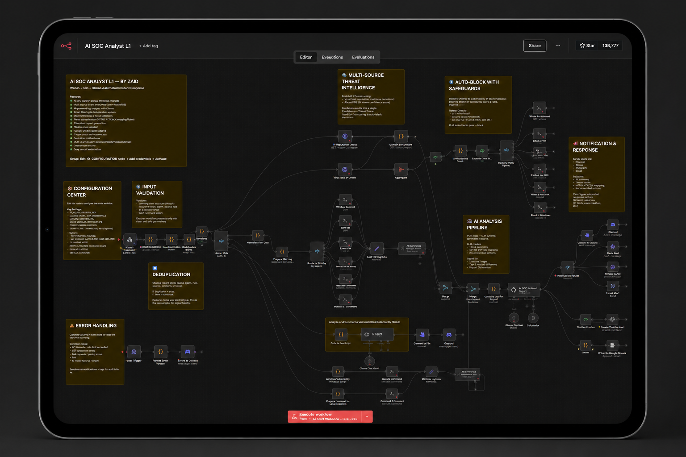
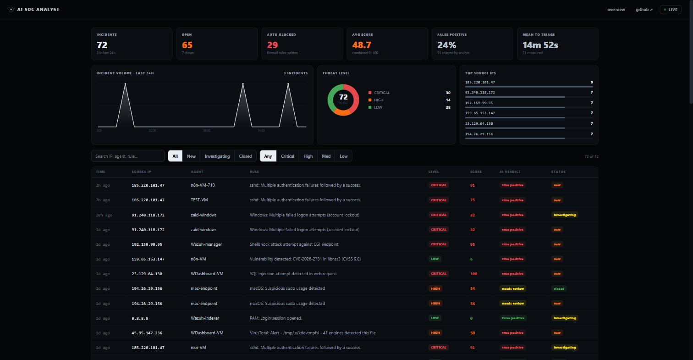
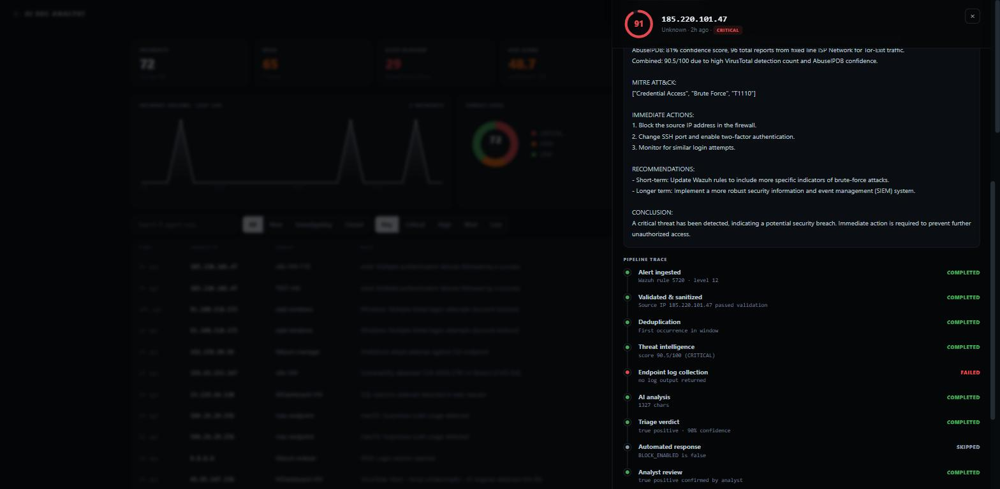
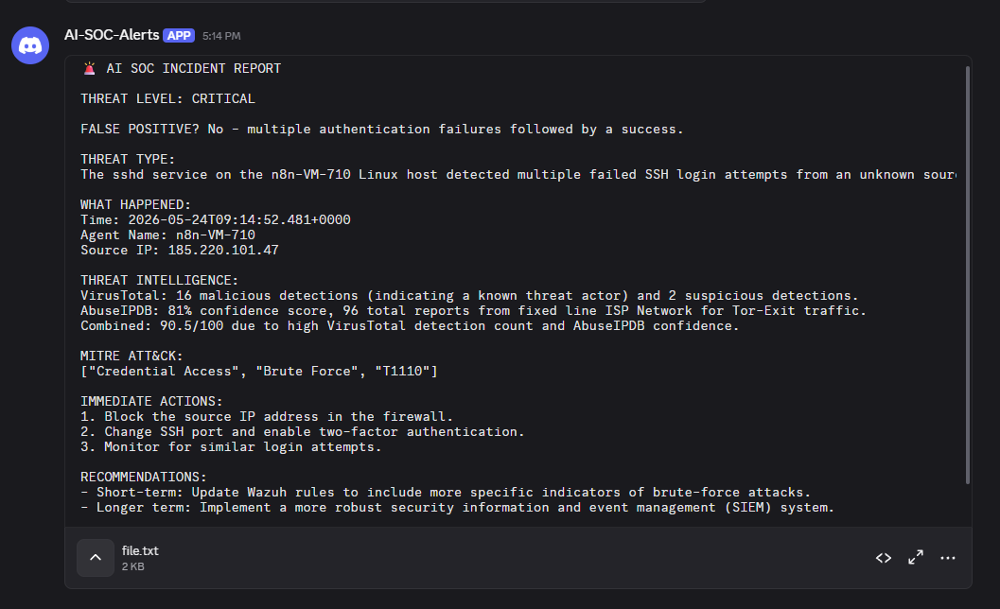
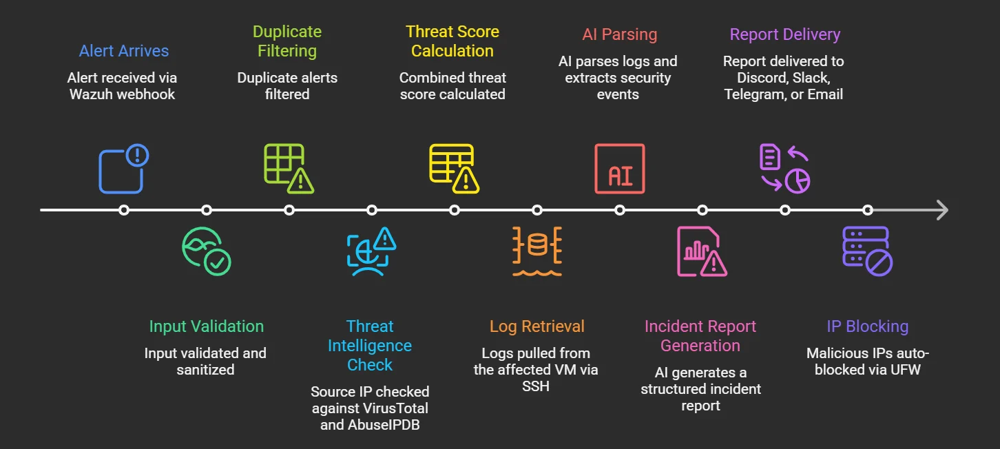
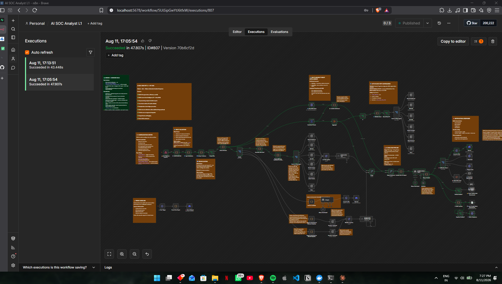

<div align="center">

# AI SOC Analyst L1

**Every level-12 alert investigated, enriched, written up and given a verdict — before an analyst opens the console.**

[**Live site**](https://zaidzyy.github.io/AI-SOC-Analyst-L1/) · [**Live dashboard**](https://zaidzyy.github.io/AI-SOC-Analyst-L1/dashboard.html) · [**Blog**](https://bit.ly/4asozzA)


`Wazuh` · `n8n` · `Ollama` · `Postgres` · `Supabase` — 90 nodes, local inference, nothing leaves the network

</div>

---



## Why this exists

Wazuh tells you *something happened*. It does not tell you what it means, whether it matters, or what to do next. So a tier-1 analyst does the same six things on every alert: look up the source IP, SSH into the host, tail the logs, work out whether it's real, write it up, paste it in a channel.

That loop is the whole job of this workflow. A level-12 alert arrives on a webhook and it:

- **validates and strips shell metacharacters** from the alert before any value touches an SSH session
- **drops duplicates**, so a 200-attempt brute force costs one report instead of two hundred
- **works out which OS** the host runs and **logs in over SSH** to pull the log lines around the event
- **enriches the source IP** with VirusTotal *and* AbuseIPDB into a single 0–100 threat score
- has a **local LLM** write an incident report **and return a structured verdict** — true/false positive, confidence, MITRE technique
- **delivers it to every channel you list, simultaneously**
- optionally **blocks the IP** with `ufw`, behind four independent safeguards
- **records what it actually did**, including the steps that failed
- and hands it to a **human, who confirms or overrides the verdict**

That last step is what turns the false-positive rate into a measurement instead of a guess.

---

## Measured, not claimed

| | |
|---|---|
| **72** | incidents triaged end to end |
| **24%** | false-positive rate — 51 confirmed by a human, not estimated |
| **1m 50s** | alert → written report (two local LLM passes) |
| **90.5/100** | combined threat score on the SSH brute-force sample → `CRITICAL` |
| **16** | documented fixes — **6 found only by running it** |
| **5/5** | crafted injection payloads blocked |
| **0** | bytes leaving the network |

---

## The dashboard



Six KPIs including **false-positive rate** and **mean time to triage** — both computed from analyst verdicts, so they measure the system rather than describe it.

### Every incident carries its own pipeline trace



The trace is built from `actions_taken`, which the workflow writes per alert. It is not a diagram — it is a record. Failed log collection shows as **failed**. A block that didn't fire shows **skipped**, with the reason:

```
Endpoint log collection    no log output returned              FAILED
Automated response         BLOCK_ENABLED is false              SKIPPED
Triage verdict             true positive · 90% confidence      COMPLETED
Analyst review             true positive confirmed by analyst  COMPLETED
```

An analyst confirms or overrides the AI verdict in the same panel. That write-back is what feeds the false-positive rate.

### The same incident, delivered



This is the alert above as it lands in Discord — the same source IP, the same `90.5/100`, the same `T1110`. Written by a local model in about a minute, with the full report attached as a file so a long incident never gets truncated by a message limit.

Every claim in it is traceable: the VirusTotal and AbuseIPDB figures are the looked-up values, the MITRE technique comes from the Wazuh rule rather than the model's memory, and the combined score is computed in code — the model is told what it is and forbidden from overriding it.

The same report goes to Slack, Telegram and a designed HTML email in parallel, if you list them.

---

## The AI writes the report. It does not decide what happens.

Blocking is deterministic and gated four ways. **All four must agree** before a single firewall rule is written:

1. `BLOCK_ENABLED` master switch — **off by default**
2. CIDR allowlist — RFC1918 and public resolvers preloaded, IPv4 **and** IPv6
3. Minimum Wazuh rule level — level 12–13 alerts are reported, never blocked
4. VirusTotal detection threshold

The model's severity **cannot override** the computed threat score. When threat intel is unavailable the record reads `unknown` — never `clean`. Inference runs on a local Ollama model, so alert contents, log excerpts and hostnames never reach a cloud provider.

---

## How it works

| Stage | What happens |
|---|---|
| **Trigger** | Webhook, authenticated with a shared header. Wazuh POSTs alerts at level ≥ 12. Payloads that aren't Wazuh alerts are rejected before any node runs |
| **Harden** | IPv4/IPv6 validation, shell-metacharacter stripping, log paths constrained to an allowlist |
| **Deduplicate** | Same IP + rule + agent inside a configurable window is counted and dropped |
| **Detect OS** | Seven alert fields checked in priority order — agent, decoder, program name, log content, rule groups, syscheck path, location |
| **Collect** | Live host logs over SSH — `journalctl`/`tail` on Linux, `Get-WinEvent` on Windows, `log show` on macOS |
| **Enrich** | VirusTotal + AbuseIPDB → combined 0–100 score → CRITICAL / HIGH / MEDIUM / LOW |
| **Analyse** | Two local Ollama passes — a log parser extracts security events, then a SOC report is written from those findings plus the intel |
| **Decide** | A structured verdict is parsed out of the report into fields: verdict, confidence, severity, MITRE technique |
| **Respond** | Optional `sudo ufw deny`, behind the four gates above |
| **Notify** | Discord, Slack, Telegram and a designed HTML email — every channel you list, in parallel, each continuing on error |
| **Record** | A row in Postgres with the full report, the raw logs, and a timeline of what actually happened |
| **Confirm** | A human accepts or overrides the verdict in the dashboard |

Wazuh **vulnerability-detector** alerts take a separate path and produce a plain-language CVE assessment instead.



### A real execution



Ninety nodes, one alert, 47.8 seconds end to end. Green edges are the path this alert actually took — the SSH branch it needed, the intel lookups it ran, the notification channels it fired. The unlit branches are the operating systems and response paths it didn't need.

---

## Six bugs that were invisible until I ran it

Static review found ten problems. Running the pipeline found six more — and **every one of those six failed silently.** Wrong numbers, a missing report, or a report about nothing. Never a crash. The workflow reported success the entire time.

| What was wrong | Why it was invisible | Before → after |
|---|---|---|
| **Threat score ignored VirusTotal entirely** | Both intel nodes fed the same input, so only one ever arrived. VT contributed **zero** to every score the system had ever produced. | `40.5 MEDIUM` → `90.5 CRITICAL` |
| **The correct score was computed, then discarded** | The scoring node executed twice; the consumer took whichever result landed first. | `0 / LOW` → `50 / HIGH` |
| **Reports failed on every Windows and macOS alert** | The report prompt referenced a Linux-only node 12 times. Multi-OS support was real for log *collection*, never for report *generation*. | `node not executed` → full report |
| **Sanitization was decorative** | Validated values were computed and then never used — the raw alert field reached the shell instead. | injectable → **5/5 blocked** |
| **The model invented the attack type** | It called a crypto-miner detection and a Windows valid-account logon both "SSH brute force", with fabricated MITRE IDs (`T1208` isn't a real technique). | `T1208 ✗` → `T1078 ✓` |
| **Any JSON produced a confident incident report** | A one-line health check — `{"test":"ping"}` — ran the full pipeline and returned a written report about a malware infection. The model read empty fields and wrote a narrative around them. | fabricated incident → **rejected at node 1** |

The last one is the one I'd flag in a review: an authenticated-but-malformed POST could **manufacture incidents**, and a language model treated missing data as evidence. Both normalization nodes now verify the payload is a Wazuh alert before anything else runs.

The full audit trail — all 16 fixes, what each broke, and how it was verified — is in [`CHANGELOG.md`](CHANGELOG.md).

---

## Robustness

Twenty-two nodes carry retry and continue-on-error policies, because a homelab is not a datacentre:

- **SSH nodes** — 2 tries, then continue with an empty result. An unreachable host produces a report without log context rather than no report at all
- **Threat intel** — 3 tries with a 5-second backoff, sized for VirusTotal's free tier (4 requests/minute)
- **Delivery** — 3 tries each, independent. A dead Slack webhook cannot stop the Discord message
- **Deduplication** — an alert is only committed to the suppression list *after* a report exists. A crashed run no longer swallows the alert for the next 15 minutes

One deliberate trade-off worth stating: because delivery and database writes continue on error, **a failed write is silent by design**. It is visible in the n8n execution log, not in an alert. That choice keeps a database outage from blocking incident notifications.

---

## Tech stack

**Security** — Wazuh SIEM · VirusTotal · AbuseIPDB · UFW · TheHive (optional)
**AI** — Ollama, `llama3.1:8b`, local inference on all four AI nodes
**Automation** — n8n, 90 nodes, event-driven
**Data** — Supabase / Postgres with row-level security
**Frontend** — vanilla HTML/CSS/JS, hand-rolled SVG charts, no build step
**Languages** — JavaScript, Bash, PowerShell
**Platforms** — Linux, Windows, macOS

---

## What's in this repo

```
├── docs/                  the live site (GitHub Pages)
│   ├── index.html         landing page
│   ├── dashboard.html     live incident dashboard
│   └── assets/
├── samples/
│   ├── sample-report.html open in a browser to see real output
│   └── test-alerts/       3 realistic Wazuh alerts to fire at the webhook
├── bonus/
│   └── email-templates/   3 drop-in HTML report designs
├── SETUP-GUIDE.md         step-by-step, ~30 min to live
├── CONFIGURATION.md       every setting explained
├── CHANGELOG.md           all 16 fixes and how each was verified
└── screenshots/
```

> **The workflow JSON is deliberately not published.** It encodes my host mapping and infrastructure layout. Reach out if you want it.

---

## Requirements

- **n8n** 1.x · **Wazuh** 4.x sending level ≥ 12 alerts to a webhook
- **Ollama** reachable from n8n — `llama3.1:8b` or similar
- **SSH reachability** to every host you want logs from (Windows needs OpenSSH Server)
- **VirusTotal** and **AbuseIPDB** API keys — free tiers are fine
- **Supabase** free project, if you want the dashboard
- At least one delivery target: Discord, Slack, Telegram or SMTP
- For auto-blocking only: `ufw` and passwordless `sudo` for it

---

## Honest scope

**What this is:** tier-1 triage automation for a homelab or a small SOC. It does the repetitive first pass and hands a human a scored, written, verdict-carrying incident.

**What it is not:** a SIEM replacement, and not a system that should act unsupervised. The blocking path is deliberately gated four ways and ships disabled.

**On the numbers:** 72 incidents across a homelab, not a production network. The 24% false-positive rate is measured from *my* analyst verdicts on *my* alert mix — it is a real measurement of this deployment, not a benchmark.

**On the model:** `llama3.1:8b` fabricated the attack type on two of three sample alerts until the prompt was rewritten to treat the Wazuh rule description as ground truth and lock MITRE to supplied values. A small local model will confabulate if you let it. The fix was constraint, not a bigger model.

---

## Roadmap

- [x] Analyst feedback loop
- [x] Structured triage verdict
- [x] Persistent incident store + live dashboard
- [x] Measured false-positive rate and mean time to triage
- [ ] Automated injection regression test in CI
- [ ] RAG-based incident memory
- [ ] Adaptive risk scoring from analyst overrides

---

## Disclaimer

For security research, SOC automation and defensive operations. Automated response actions should be validated in a controlled environment before production use.

---

<div align="center">

**Mohammed Zaid** — Cybersecurity & AI Security Engineer

[GitHub](https://github.com/Zaidzyy) · [Live site](https://zaidzyy.github.io/AI-SOC-Analyst-L1/)

</div>
